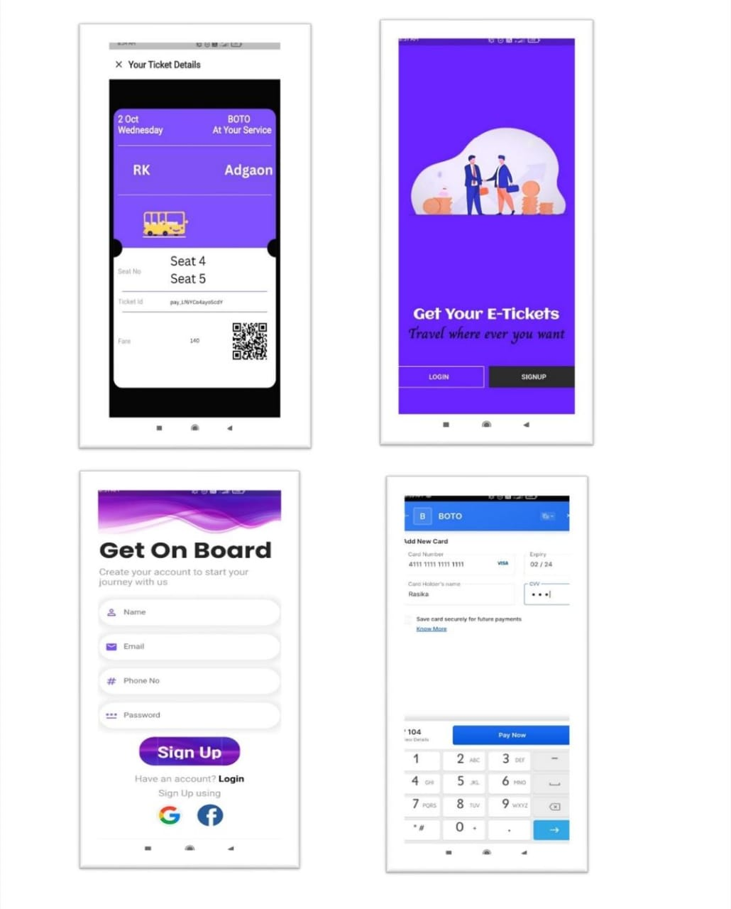
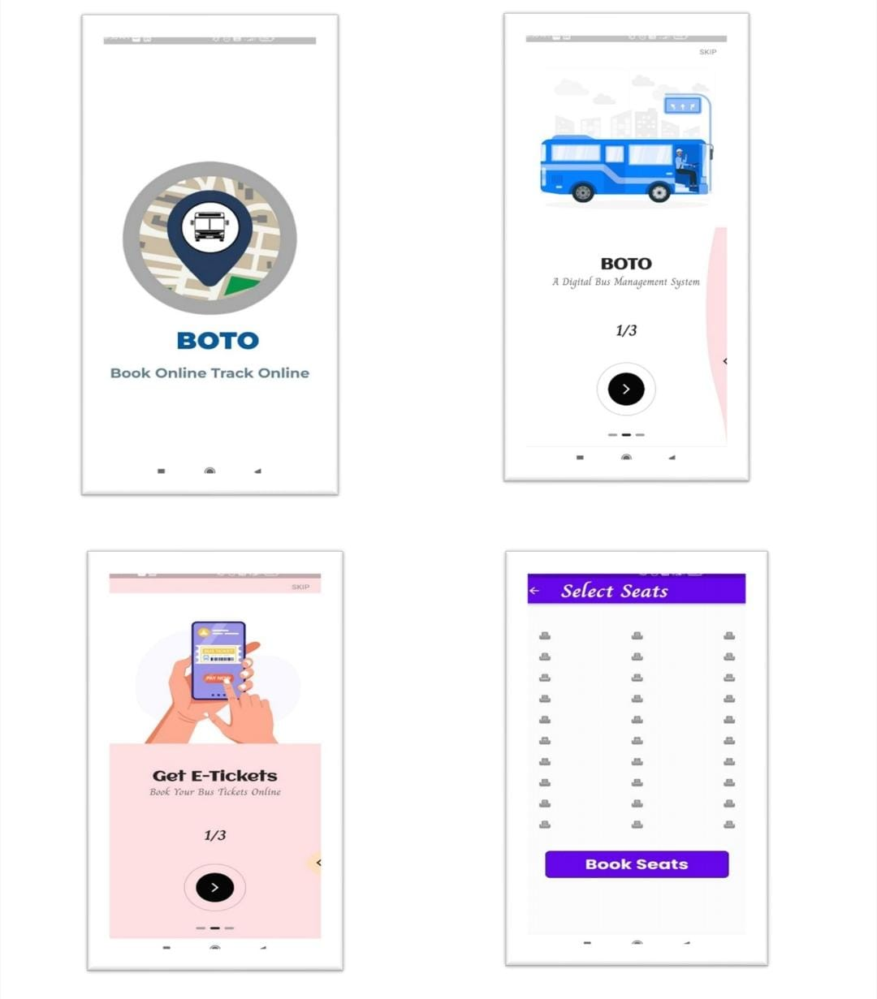
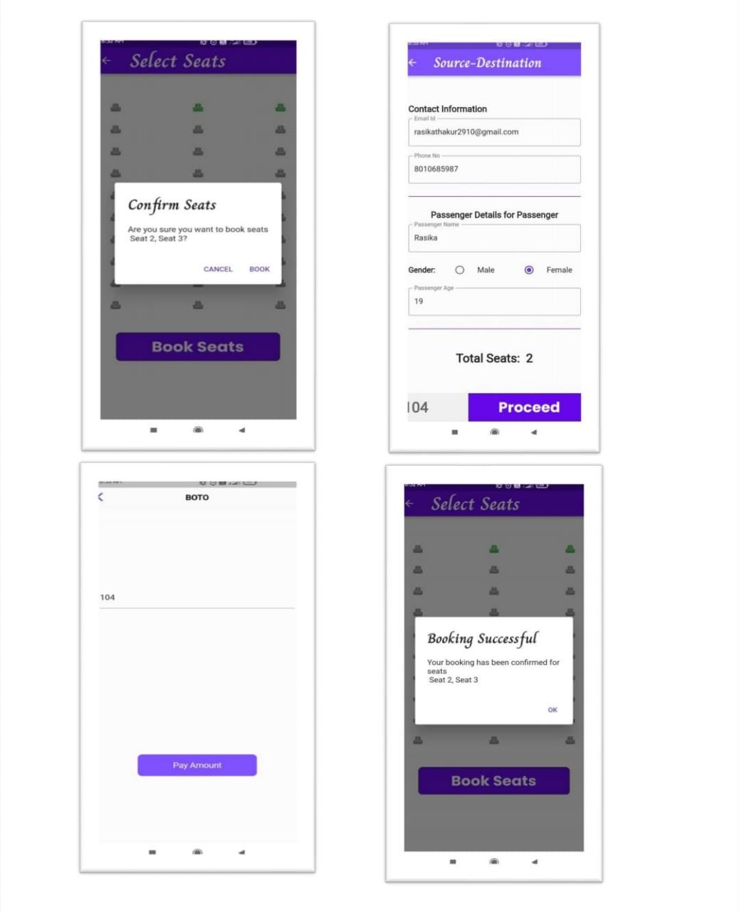

# BusTracking Project

## Overview
The **BusTracking Project** aims to modernize the bus booking and journey experience by providing an intuitive and efficient system that simplifies ticket booking and enables real-time bus tracking. This project addresses key pain points of traditional bus booking methods, such as time-consuming processes, lack of real-time information, and uncertainties during the journey.

---

## Problem Statement
Traditional bus booking methods are inefficient and outdated:
- Passengers often need to visit bus terminals physically, which is inconvenient for those with busy schedules or those living far away.
- Lack of real-time seat availability and bus status information leads to confusion and delays.
- Uncertainty about the bus's location during the journey causes anxiety, especially for long-distance travelers.
- Existing bus tracking services may suffer from technical issues, data inaccuracies, or delays in updates.

### Solution
Our **BusTracking Project** offers a robust system for:
- **Convenient Bus Booking**: Passengers can book tickets easily through a mobile app.
- **Real-Time Tracking**: Get live updates on bus locations and estimated arrival times.
- **Enhanced User Experience**: A seamless and secure booking and tracking interface for passengers and operators.
- **Operational Efficiency**: Optimize bus routes and schedules based on real-time data.

---

## Objectives
1. **Simplify the Booking Process**:
   - Provide an easy-to-use interface for searching routes, selecting seats, and making payments.
   - Streamline the booking process to attract more passengers.

2. **Enable Real-Time Tracking**:
   - Display live bus locations and estimated arrival times via the app.
   - Help passengers plan their journey better and reduce anxiety.

3. **Ensure Security**:
   - Protect sensitive user data, including personal and payment information.
   - Use secure authentication mechanisms.

4. **Improve Efficiency**:
   - Enable bus operators to optimize routes and reduce wait times.
   - Enhance resource utilization and operational profitability.

---

## Tech Stack
- **Flutter**: Cross-platform mobile app development.
- **Firebase**: Backend for authentication, database, and real-time updates.

---

## Features
1. **User-Friendly Booking**:
   - Search for available bus routes and schedules.
   - Select preferred seats and pay seamlessly.

2. **Live Bus Tracking**:
   - View real-time bus location on an interactive map.
   - Receive updates on delays or changes in schedule.

3. **Secure System**:
   - Data encryption for secure payment and personal information.
   - Firebase authentication for user accounts.

4. **Operator Dashboard**:
   - Manage bus schedules and bookings efficiently.
   - Analyze data to improve operations.

---

## Installation
1. Clone the repository:
   ```bash
   git clone https://github.com/rasikathakur/BusTrackingProject.git
   ```
2. Navigate to the project directory:
   ```bash
   cd BusTrackingProject
   ```
3. Install dependencies:
   ```bash
   flutter pub get
   ```
4. Run the app:
   ```bash
   flutter run
   ```

---

## Pictures




---

## Research Papers
1. [Published Paper on BusTracking System](https://ijarcce.com/papers/online-bus-booking-and-tracking-system/) 
2. [Paper on BusTracking System - Drive Link](https://docs.google.com/document/d/1t_XpI2vTaHhwvhfHSikx9vJsSMtiQQYI/edit?usp=sharing&ouid=107362093645788226897&rtpof=true&sd=true)

---

## Contact
For queries or feedback, contact:
- **Email**: rasikathakur303@gmail.com
